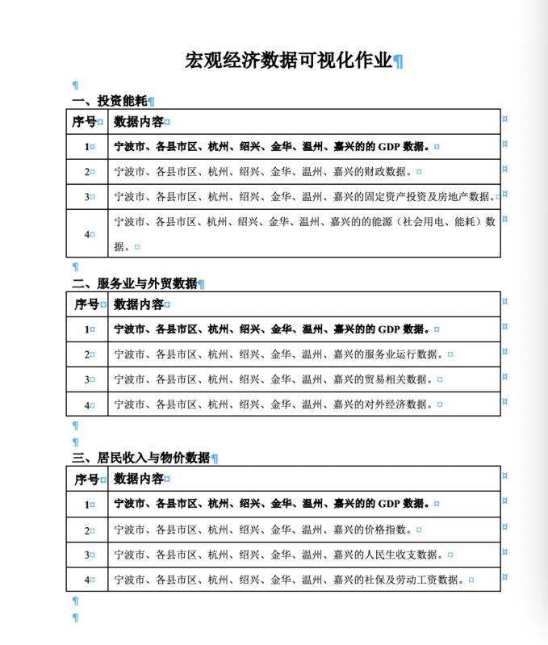

# vue-charts

> A Vue.js project

## Build Setup

``` bash
# install dependencies
npm install

npm install node-sass --save-dev

npm install sass-loader --save-dev

# serve with hot reload at localhost:8080
npm run dev

# build for production with minification
npm run build

# build for production and view the bundle analyzer report
npm run build --report
```

# 数据可视化大作业——宏观经济可视化系统
### 作业内容（三选一）：


### 最终效果 Demo：

